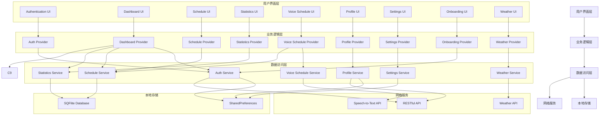
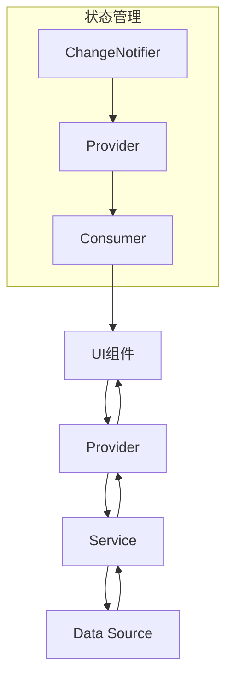

# 架构设计

## 1. 架构概述

Life Fit采用模块化、分层架构设计，基于Flutter框架开发，支持跨平台运行。架构设计遵循高内聚、低耦合原则，便于维护和扩展。

### 1.1 设计原则
- **模块化**：按功能划分模块，每个模块职责清晰
- **分层设计**：采用清晰的分层架构，便于维护和扩展
- **高内聚低耦合**：模块内部高内聚，模块间低耦合
- **可测试性**：设计便于测试的组件和接口
- **可扩展性**：支持功能扩展和第三方集成

### 1.2 架构风格
- **MVC（Model-View-Controller）**：经典的架构模式，分离数据、视图和控制逻辑
- **MVVM（Model-View-ViewModel）**：通过Provider实现，分离UI和业务逻辑
- **模块化架构**：按功能划分为独立模块

## 2. 系统架构图



## 3. 模块划分

### 3.1 核心模块

#### 3.1.1 Core模块
- **职责**：提供应用的核心功能和通用组件
- **子模块**：
  - **localization**：国际化支持
  - **services**：通用服务，如日志服务、存储服务
  - **theme**：主题管理，支持浅色/深色主题

#### 3.1.2 依赖关系
- **外部依赖**：Flutter SDK、Provider
- **内部依赖**：无

### 3.2 功能模块

#### 3.2.1 Authentication模块
- **职责**：处理用户认证，包括登录、注册、密码重置等
- **核心组件**：
  - `AuthProvider`：管理认证状态
  - `AuthService`：处理认证逻辑
  - `LoginScreen`：登录界面
  - `RegisterScreen`：注册界面
- **依赖关系**：
  - **外部依赖**：shared_preferences
  - **内部依赖**：core模块

#### 3.2.2 Onboarding模块
- **职责**：新用户引导流程
- **核心组件**：
  - `OnboardingProvider`：管理引导流程状态
  - `OnboardingScreen`：引导流程界面
- **依赖关系**：
  - **外部依赖**：shared_preferences
  - **内部依赖**：core模块

#### 3.2.3 Dashboard模块
- **职责**：应用的主仪表盘，展示关键信息和快捷操作
- **核心组件**：
  - `DashboardProvider`：管理仪表盘状态
  - `DashboardService`：处理仪表盘逻辑
  - `DashboardScreen`：仪表盘界面
- **依赖关系**：
  - **外部依赖**：provider
  - **内部依赖**：authentication、schedule、statistics、weather模块

#### 3.2.4 Schedule模块
- **职责**：管理用户的健身日程
- **核心组件**：
  - `ScheduleProvider`：管理日程状态
  - `ScheduleService`：处理日程逻辑
  - `ScheduleDatabase`：数据库操作
  - `ScheduleScreen`：日程管理界面
- **依赖关系**：
  - **外部依赖**：sqflite、provider
  - **内部依赖**：core模块

#### 3.2.5 Statistics模块
- **职责**：统计和分析用户的健身数据
- **核心组件**：
  - `StatisticsProvider`：管理统计数据
  - `StatisticsService`：处理统计逻辑
  - `StatisticsScreen`：统计分析界面
- **依赖关系**：
  - **外部依赖**：fl_chart、provider
  - **内部依赖**：schedule模块

#### 3.2.6 Voice Schedule模块
- **职责**：通过语音创建和管理日程
- **核心组件**：
  - `VoiceScheduleProvider`：管理语音日程状态
  - `VoiceScheduleService`：处理语音识别逻辑
  - `VoiceScheduleScreen`：语音日程界面
- **依赖关系**：
  - **外部依赖**：speech_to_text、provider
  - **内部依赖**：schedule模块

#### 3.2.7 Profile模块
- **职责**：管理用户的个人资料
- **核心组件**：
  - `ProfileProvider`：管理个人资料状态
  - `ProfileService`：处理个人资料逻辑
  - `ProfileScreen`：个人资料界面
- **依赖关系**：
  - **外部依赖**：provider
  - **内部依赖**：authentication模块

#### 3.2.8 Settings模块
- **职责**：管理应用的设置
- **核心组件**：
  - `SettingsProvider`：管理设置状态
  - `SettingsService`：处理设置逻辑
  - `SettingsScreen`：设置界面
- **依赖关系**：
  - **外部依赖**：shared_preferences、provider
  - **内部依赖**：core模块

#### 3.2.9 Weather模块
- **职责**：提供天气信息
- **核心组件**：
  - `WeatherProvider`：管理天气状态
  - `WeatherService`：处理天气API调用
  - `WeatherWidget`：天气组件
- **依赖关系**：
  - **外部依赖**：http、provider
  - **内部依赖**：core模块

## 4. 数据流设计

### 4.1 数据流向

1. **用户交互**：用户在UI层进行操作
2. **状态更新**：UI层通知Provider更新状态
3. **业务逻辑处理**：Provider调用Service层处理业务逻辑
4. **数据访问**：Service层访问本地存储或网络服务
5. **数据返回**：本地存储或网络服务返回数据
6. **状态更新**：Service层将数据返回给Provider，Provider更新状态
7. **UI更新**：UI层响应状态变化，更新界面

### 4.2 数据模型

#### 4.2.1 用户模型
```dart
class User {
  final String id;
  final String email;
  final String name;
  final String? avatar;
  final DateTime createdAt;
  final DateTime updatedAt;
  
  User({
    required this.id,
    required this.email,
    required this.name,
    this.avatar,
    required this.createdAt,
    required this.updatedAt,
  });
}
```

#### 4.2.2 日程模型
```dart
class ScheduleEvent {
  final int id;
  final String title;
  final String description;
  final DateTime startTime;
  final DateTime endTime;
  final String type;
  final bool isCompleted;
  final DateTime createdAt;
  final DateTime updatedAt;
  
  ScheduleEvent({
    required this.id,
    required this.title,
    required this.description,
    required this.startTime,
    required this.endTime,
    required this.type,
    required this.isCompleted,
    required this.createdAt,
    required this.updatedAt,
  });
}
```

#### 4.2.3 统计模型
```dart
class Statistics {
  final int totalWorkouts;
  final int totalMinutes;
  final double totalCalories;
  final Map<String, dynamic> weeklyData;
  final Map<String, dynamic> monthlyData;
  final Map<String, dynamic> yearlyData;
  
  Statistics({
    required this.totalWorkouts,
    required this.totalMinutes,
    required this.totalCalories,
    required this.weeklyData,
    required this.monthlyData,
    required this.yearlyData,
  });
}
```

#### 4.2.4 天气模型
```dart
class Weather {
  final String city;
  final double temperature;
  final String description;
  final String icon;
  final double humidity;
  final double windSpeed;
  final DateTime updatedAt;
  
  Weather({
    required this.city,
    required this.temperature,
    required this.description,
    required this.icon,
    required this.humidity,
    required this.windSpeed,
    required this.updatedAt,
  });
}
```

## 5. 状态管理设计

### 5.1 状态管理方案

Life Fit使用Provider进行状态管理，Provider是Flutter官方推荐的状态管理解决方案，简单易用，适合中小型应用。

### 5.2 状态管理架构



### 5.3 状态管理流程

1. **状态定义**：创建ChangeNotifier类定义状态和更新方法
2. **状态提供**：使用Provider在Widget树中提供状态
3. **状态监听**：使用Consumer或Provider.of监听状态变化
4. **状态更新**：调用ChangeNotifier的方法更新状态
5. **UI重建**：状态变化触发UI重建

## 6. 本地存储设计

### 6.1 存储方案

- **SharedPreferences**：存储简单的键值对数据，如用户偏好设置、认证凭证
- **SQFlite**：存储结构化数据，如日程、统计数据

### 6.2 数据库设计

#### 6.2.1 数据库表结构

**用户表（users）**
| 字段名 | 类型 | 描述 |
|-------|------|------|
| id | TEXT | 用户ID |
| email | TEXT | 用户邮箱 |
| name | TEXT | 用户名称 |
| avatar | TEXT | 用户头像URL |
| created_at | INTEGER | 创建时间戳 |
| updated_at | INTEGER | 更新时间戳 |

**日程表（schedule_events）**
| 字段名 | 类型 | 描述 |
|-------|------|------|
| id | INTEGER | 日程ID（主键） |
| title | TEXT | 日程标题 |
| description | TEXT | 日程描述 |
| start_time | INTEGER | 开始时间戳 |
| end_time | INTEGER | 结束时间戳 |
| type | TEXT | 日程类型 |
| is_completed | INTEGER | 是否完成（0/1） |
| created_at | INTEGER | 创建时间戳 |
| updated_at | INTEGER | 更新时间戳 |

**统计表（statistics）**
| 字段名 | 类型 | 描述 |
|-------|------|------|
| id | INTEGER | 统计ID（主键） |
| date | TEXT | 统计日期（YYYY-MM-DD） |
| workouts | INTEGER |  workout数量 |
| minutes | INTEGER | 总时长（分钟） |
| calories | REAL | 消耗卡路里 |
| created_at | INTEGER | 创建时间戳 |
| updated_at | INTEGER | 更新时间戳 |

## 7. 网络架构设计

### 7.1 API架构

- **RESTful API**：采用RESTful设计风格
- **API版本控制**：通过URL路径进行版本控制，如`/api/v1/users`
- **认证方式**：使用Bearer Token进行认证
- **数据格式**：JSON格式

### 7.2 API接口设计

#### 7.2.1 用户相关API
- `POST /api/v1/users/register`：用户注册
- `POST /api/v1/users/login`：用户登录
- `GET /api/v1/users/me`：获取当前用户信息
- `PUT /api/v1/users/me`：更新当前用户信息
- `POST /api/v1/users/logout`：用户登出

#### 7.2.2 日程相关API
- `GET /api/v1/schedule`：获取日程列表
- `POST /api/v1/schedule`：创建日程
- `GET /api/v1/schedule/:id`：获取单个日程
- `PUT /api/v1/schedule/:id`：更新日程
- `DELETE /api/v1/schedule/:id`：删除日程

#### 7.2.3 统计相关API
- `GET /api/v1/statistics`：获取统计数据
- `GET /api/v1/statistics/weekly`：获取周统计数据
- `GET /api/v1/statistics/monthly`：获取月统计数据
- `GET /api/v1/statistics/yearly`：获取年统计数据

### 7.3 网络请求实现

- **HTTP客户端**：使用Dio库进行网络请求
- **请求拦截器**：添加认证令牌、请求日志
- **响应拦截器**：处理错误响应、解析响应数据
- **错误处理**：统一的错误处理机制

## 8. 安全架构设计

### 8.1 认证与授权

- **用户认证**：基于Email/Password的认证机制
- **令牌管理**：使用JWT（JSON Web Token）进行认证
- **令牌存储**：安全存储令牌，防止泄露
- **权限控制**：基于角色的访问控制（RBAC）

### 8.2 数据安全

- **数据加密**：对敏感数据进行加密存储
- **传输安全**：使用HTTPS协议进行数据传输
- **数据脱敏**：对敏感数据进行脱敏处理
- **数据备份**：定期备份用户数据

### 8.3 应用安全

- **防止注入攻击**：使用参数化查询，防止SQL注入
- **防止XSS攻击**：对输入进行验证和净化
- **防止CSRF攻击**：使用CSRF令牌
- **代码混淆**：对发布版本进行代码混淆
- **安全审计**：定期进行安全审计

## 9. 扩展性设计

### 9.1 插件系统设计

Life Fit设计了可扩展的插件系统，支持功能模块化扩展。插件系统允许开发者添加新功能，而不需要修改核心代码。

#### 9.1.1 插件接口

```dart
abstract class Plugin {
  String get name;
  String get version;
  
  void initialize();
  void dispose();
  
  Widget? get widget;
}
```

#### 9.1.2 插件管理

```dart
class PluginManager {
  final List<Plugin> _plugins = [];
  
  void registerPlugin(Plugin plugin) {
    _plugins.add(plugin);
    plugin.initialize();
  }
  
  void unregisterPlugin(String name) {
    final plugin = _plugins.firstWhere((p) => p.name == name);
    plugin.dispose();
    _plugins.remove(plugin);
  }
  
  List<Plugin> get plugins => _plugins;
}
```

### 9.2 第三方集成设计

Life Fit支持与多种第三方服务集成，如：

- **认证服务**：Google登录、Apple登录
- **云存储服务**：Firebase Storage、AWS S3
- **分析服务**：Firebase Analytics、Google Analytics
- **推送通知**：Firebase Cloud Messaging
- **地图服务**：Google Maps、Apple Maps

## 10. 性能优化设计

### 10.1 启动优化

- **延迟加载**：非关键资源延迟加载
- **异步初始化**：使用异步方式初始化资源
- **减少依赖**：减少不必要的依赖项
- **预加载**：预加载常用资源

### 10.2 内存优化

- **合理使用缓存**：避免内存泄漏
- **及时释放资源**：不再使用的资源及时释放
- **优化图片加载**：使用图片缓存、压缩图片
- **减少对象创建**：避免频繁创建对象

### 10.3 UI性能优化

- **使用const构造器**：减少Widget重建
- **优化setState调用**：避免不必要的setState调用
- **使用ListView.builder**：懒加载列表项
- **使用RepaintBoundary**：减少重绘范围
- **优化动画**：使用高效的动画实现

## 11. 测试架构设计

### 11.1 测试类型

- **单元测试**：测试核心业务逻辑、工具类
- **集成测试**：测试模块间的交互
- **UI测试**：测试用户界面流程
- **性能测试**：测试应用性能

### 11.2 测试框架

- **flutter_test**：Flutter官方测试框架
- **mockito**：用于模拟依赖项
- **integration_test**：用于集成测试
- **performance_test**：用于性能测试

### 11.3 测试策略

- **测试覆盖率**：目标覆盖率80%+
- **持续集成**：CI流程中自动运行测试
- **测试驱动开发**：部分功能采用TDD开发

## 12. 部署架构设计

### 12.1 部署环境

- **开发环境**：开发者本地环境
- **测试环境**：专门的测试服务器
- **预发布环境**：与生产环境相似的环境
- **生产环境**：正式发布环境

### 12.2 部署流程

1. **代码提交**：开发者将代码提交到Git仓库
2. **持续集成**：CI流程自动运行测试和构建
3. **部署测试**：自动部署到测试环境
4. **测试验证**：测试团队进行测试
5. **部署预发布**：部署到预发布环境
6. **预发布验证**：进行预发布验证
7. **部署生产**：部署到生产环境
8. **监控维护**：监控应用运行状态，及时处理问题

## 13. 监控与维护设计

### 13.1 错误监控

- **崩溃监控**：集成Firebase Crashlytics，收集崩溃日志
- **错误日志**：记录应用错误日志
- **错误分析**：定期分析错误日志，修复问题

### 13.2 性能监控

- **性能指标**：监控启动时间、内存使用、UI响应速度等
- **性能分析**：定期分析性能数据，优化性能
- **性能警报**：设置性能警报，及时发现性能问题

### 13.3 用户反馈

- **反馈渠道**：提供多种反馈渠道，如应用内反馈、邮件反馈
- **反馈处理**：建立反馈处理流程，及时处理用户反馈
- **反馈分析**：定期分析用户反馈，改进产品

## 14. 结论

Life Fit的架构设计采用模块化、分层架构，基于Flutter框架开发，支持跨平台运行。架构设计遵循高内聚、低耦合原则，便于维护和扩展。系统架构图清晰展示了各模块之间的关系和数据流，状态管理设计使用Provider进行状态管理，本地存储设计结合了SharedPreferences和SQFlite，网络架构设计采用RESTful API，安全架构设计考虑了认证与授权、数据安全和应用安全等方面。扩展性设计支持插件系统和第三方集成，性能优化设计考虑了启动优化、内存优化和UI性能优化等方面，测试架构设计包括单元测试、集成测试和UI测试，部署架构设计考虑了不同环境的部署流程，监控与维护设计包括错误监控、性能监控和用户反馈等方面。

通过合理的架构设计，Life Fit能够满足当前的功能需求，同时为未来的扩展和优化提供了良好的基础。